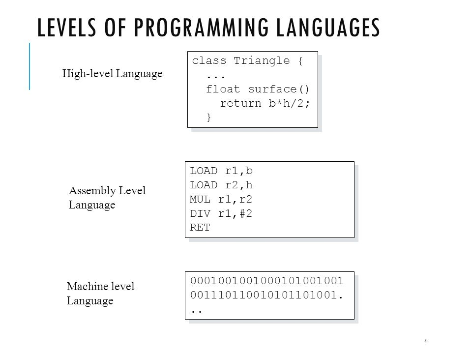

# More About Python

## High Level

Python is a very high level language. Programming languages can be classified by 3 levels: high level, assembly level and low level. The following diagram is useful:

The lowest level is machine language, the language the computer understands. A 1 represents high voltage whereas a 0 represents low/no voltage. If you need to program below this level you'll be programming the hardware directly.

Assembly level languages provides some abstraction over machine level. In assembly, you typically write operations that are close to or match machine code instructions. For example, LOAD r1, b stores the value of b in the register r1. Assembly code varies by architecture. That means that assembly code you may write for a laptop with an Intel processor would very likely be different from assembly you'll write for a smartphone's ARM processor. Most developers code in assembly if they're working on software for the CPU or other low level devices, or where they need more speed than a high level language. Assembly is converted to machine code by an assembler.

High level languages abstract even further from machine code. In many cases they use near natural language like expressions to provide instructions to the computer. These abstractions come with some major benefits: much easier to remember, can be made to run on many different machines, takes away tedious tasks like managing memory and registers. The major downside is that code written in high level languages tend to take longer to prepare and execute and usually consume more computer resources. High level languages are converted to machine code by a compiler or interpreter.

## Compiled or Interpreted?

As mentioned before, these take code from a high level language and convert them to machine code so the computer can run them. If the code is translated by a compiler then the computer creates machine readable instructions before we run the program. If the code is translated by an interpreter then the computer creates machine readable instructions while the program is being run.

Python is described an interpreted language. You can get away with saying that but unfortunately it's not that simple. Strictly speaking, the Python programming language is neither compiled nor interpreted, its implementation can be. The language is the rules by which a program can be created, it's implementation can vary how it is executed. It's also quite common for languages to neither be compiled or interpreted, sometimes they're a bit of both.

The Python used in this course is referred to as CPython, which is interpreted. There are other implementations of the Python language like PyPy, Jython, and IronPython. Those aren't entirely interpreted. Look at [this discussion on Stack Overflow for some interesting details](https://stackoverflow.com/questions/6889747/is-python-interpreted-or-compiled-or-both).

## Object Oriented

Programming languages are designed differently, in some cases following a paradigm which makes it really good at solving particular problems. In Object Oriented programming, we have a data structure that's called an `object`. Objects store data in `properties` and can perform certain tasks though interal functions called `methods`. For example, if we were creating a car objects we'd have properties like wheels, colour, model, number of seats; and methods like accelerate, stop, activate windscreen wipers, etc.

Python can be coded in an object oriented style but is also flexible to do other styles like procedural and functional as well. It's general purpose enough to allow problems to solved in different ways.
