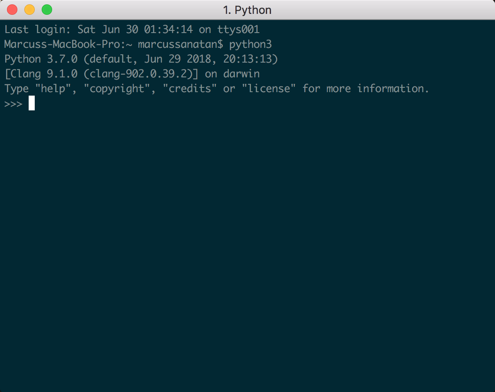

# Getting Started

In this course we'll be writing Python in both the shell and a text editor. The Python interactive shell is useful for immediate feedback. For large programs we'll want the code saved and standardised, so it's much better to have them in a file. We'll use a text editor to help make our Python code easier to write.

## Python Shell

To get started, open your Terminal and type `python3` in macOS and Linux or open Powershell and type `python` in Windows. Press enter and you'll be in the interactive Python shell. It should like similar to this:

Now type `print('Hello World')` and press enter/return. You should see Hello World on the next line. Congrats! That's your first program in Python!

## Running Code in a File

You can write code in something as basic as Notepad if you'd like but it won't provide a good programming experience. In this course we'll be using Visual Studio Code - an open source editor developed by Microsoft. You can code in many languages through it's various extensions, if you're setting up at home you'll have to install the Python extension after installing VS Code.

Programmers tend to have arugments of what editor is the best. Don't waste your time on those silly flame wars. Pick one that works for you and master it. Learn the shortcuts, how to debug your code, how to ensure your code is formatted correctly with a linter. If you're not satisfied with it, try other ones that may provide a better developer experience for you. The goal with an editor is to be as productive as you can.
