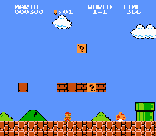
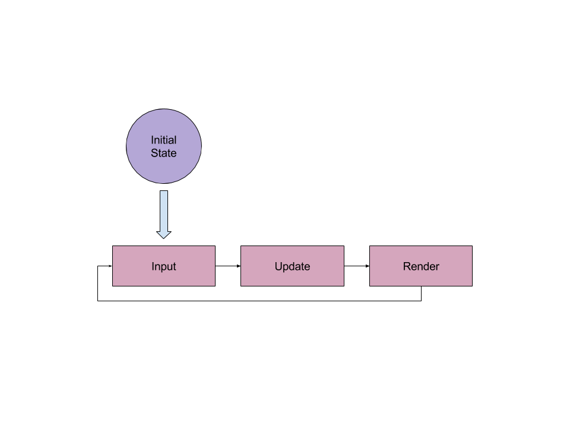

# Pygame

So by now we've got a good feel of how to construct a program in Python. Let's get to the fun part, making games! Well hold your horses for a bit. Before we jump in let's get a high-level view of how games work.

## The Game Loop

The best way to think about games is by thinking about states. Huh? Well a state is all the details of the world and objects inside it. Let's say you're doing an exam \(fun right?\). The state at a given point in time would be all the questions you answered, the amount of classmates writing the exam with you, how much ink remaining in your pen, etc.

All games have states as well. Take this classic - Super Mario Brothers!



[http://www.retrogames.cz/games/005/NES\_01.gif](http://www.retrogames.cz/games/005/NES_01.gif)

When you first start the game your state will be Mario's position at the left side of the screen, the positions of the other enemies, 0 points and 0 coins, a full timer, the beginning of the soundtrack, the player's 3 lives, Mario's small body and the fact that he's not moving. Thankfully, computers, unlike humans, are really good at managing all these various pieces.

Now when move the joystick to the right, Mario moves to the right as well. In Super Mario Brothers and in most good games, the feedback is instantenous, as you move your joystick the game updates. That's actually 2 steps in the game loop. The first is the update step - given all the inputs and the time, update the game state. So when you press the jump button, the update step will change Mario's position to be in the air instead of on the floor. Finally, after the update step we render, which as you expect displays the game on the screen. True to it's name this input -&gt; update -&gt; render process repeats until the user quits the game.



### Game Loops And Python

If you think about it, everything you covered in Python can help make the game loop. State? Think of storing data in variables, whether the data is a string, number, list, tuple or dictionary. Python has the `input` function to get user input, we'll learn new functions to get user input. When we do collect user input, we'll decide what should happen in the game with if statements. All of this will happen in a while loop that ends when the user decides to quit.

## Getting Started with Pygame

Despite the naming, Pygame isn't actually a game library or framework. It's best described as a multimedia library, it focuses on being able to connect to all the input and output devices like keyboards, joysticks and speakers. Don't be discouraged, it's quite easy to build games from this. Let's not waste time with this simple example:

In a new file `rectangles.py`, add the following lines to the top of the file:

```python
import pygame
import sys
```

So we import the Pygame library as well as the sys module, the latter is included in Python installations. Now we add some variables we'll use later

```python
WIDTH, HEIGHT = (640, 480)
BLACK = (0, 0, 0)
WHITE = (255, 255, 255)
RED = (255, 50, 50)
GREEN = (50, 255, 50)
```

The keen reader would notice two things: all the variables are capitalised; and in the first assignment WIDTH and HEIGHT are on the same line. The variables are capitalised to show they're constants i.e. values that would not change. This is a convention i.e. something the community maintains as good coding habits. You can change the values of WIDTH, WHITE, RED or the others because they're variables. By capitalising, we're really telling other coders and ourselves that these values don't change.

As we saw with `WIDTH, HEIGHT = (640, 480)`, Python has the ability to declare multiple variables in the same line. In this case, WIDTH is the first item of the tuple on the right hand side, 640, and HEIGHT is therefore the second item, 480. Recall that the values for width and height detail how many pixels are being used.

```python
pygame.init() # You MUST call this method for pygame to work
screen = pygame.display.set_mode((WIDTH, HEIGHT)) # Set the screen size in Pygame
pygame.display.set_caption('Rectangles') # Text you'll see on the window bar
```

The above code initalises Pygame. As the comment stated, you have to call `pygame.init()`. Your programs that use Pygame would not work without it! Also, notice that WIDTH and HEIGHT are wrapped in brackets. The function `pygame.display.set_mode` sets the screen size of the game. It take a sequence with a number for width followed by height, so we use a tuple. Lastly, the `set_caption` method puts the title of the window bar you'll see when running Pygame. Now that the setup is done, let's do something!

```python
while True:
    for event in pygame.event.get():
        if event.type==pygame.QUIT:
            pygame.quit()
            sys.exit()

    screen.fill(BLACK) # Paint the screen black
    pygame.draw.rect(screen,RED,(0, 0,50,50)) # Draw a red rectangle
    pygame.display.update() # Render the changes to the screen
```

So the while loop is actually where our game loop begins with the while loop. We only want the while loop to quit when the user quits, and there's an event for that later on. So we put `while True:`, that way the loop will never exit.

In Pygame we use a for loop to get input from the player. We'll touch more on that later but also ensure to include that for loop. Pygame needs that for loop to function properly, specifically it needs a program to get the events. Even if your code does not have much user interaction like what we're making, it still needs the for loop to get events.

```python
if event.type==pygame.QUIT:
    pygame.quit()
    sys.exit()
```

Let's say you're tired of your awesome game you'll be creating and decide to quit. Well we have to ensure you're closing off your game first, we do so with the above if statement. After we verified that you want to exit, we first run `pygame.quit()` to ensure it shuts off properly. Finally we exit the Python program with good ole `sys.exit()`.

```python
screen.fill(BLACK) # Paint the screen black
pygame.draw.rect(screen,RED,(0, 0, 50, 50)) # Draw a red rectangle
pygame.display.update() # Render the changes to the screen
```

The last bit of code is less tricky than the others. First we set the background of the screen to black by filling it with black pixels. We then draw a red rectangle on the screen. Look at the arguments: the first is the screen we're drawing on, the second is the colour but the last is quite interesting. That argument is a tuple with four items describing where the rectangle is going to be drawn and how big it'll be.

\(0, 0, 50, 50\)

1. x - 0
2. y - 0
3. width - 50
4. height - 50

Strange coordinates right? Well not too strange. In Pygame and many other libraries used to create games, coordinates start at \(0, 0\) which means top-left. So think of your game screen's window. If you had to write out coordinates going from left to right, you'll start with \(0, 0\) and end with \(WIDTH, 0\). Essentially as you go right you keep adding one to the x-coordinate.

If you wanted to go downwards from the origin/top-left, you'll end up at \(0, HEIGHT\). Essentially as you go down you keep adding one to the y-coordinate. Here's a nifty diagram to help you out.  [http://ctc-dev.verkstad.cc/en/course-literature/screens-and-pixels/](http://ctc-dev.verkstad.cc/en/course-literature/screens-and-pixels/)

You'll get more hands on practice, just keep it in mind!

You should now have Python code that looks like the following:

```python
import pygame
import sys

WIDTH, HEIGHT = (640, 480)
BLACK = (0, 0, 0)
WHITE = (255, 255, 255)
RED = (255, 50, 50)
GREEN = (50, 255, 50)

pygame.init() # You MUST call this method for pygame to work
screen = pygame.display.set_mode((WIDTH, HEIGHT)) # Set the screen size in Pygame
pygame.display.set_caption('Rectangles') # Text you'll see on the window bar

while True:
    for event in pygame.event.get():
        if event.type==pygame.QUIT:
            pygame.quit()
            sys.exit()

    screen.fill(BLACK) # Paint the screen black
    pygame.draw.rect(screen,RED,(0, 0, 50, 50)) # Draw a red rectangle
    pygame.display.update() # Render the changes to the screen
```

Now let's run your file, rectangles.py. You should see the following:


Congratulations! You've just done your first Pygame script! We simply drew a red rectangle on the screen that was 50 pixels long and wide \(so really, it's a square...\).

### More Rectangles

You would have observed that we have more colours, let's draw another rectangle - it'll be green, 30px wide and 20px long, and at the bottom right corner of the screen.

The tricky part of this would be the position so let's think about it for a bit. Every Pygame object on the screen has a corresponding rectangle with its coordinates. As we mentioned before the coordinates are 4 numbers describing how far away an object is from the origin on its: x coordinate, y coordinate, width and height. The x and y coordinates are for the **top left** of the shape.

We know the screen's top left is `(0, 0)`, the top right is `(WIDTH, 0)`, the bottom left is `(0, HEIGHT)`. So what's the bottom right corner? That's right: `(WIDTH, HEIGHT)`. Confused? If you went all the way to the right you travelled the entire width of the game screen. If you went all the way to the bottom you travelled the entire height of the game screen. Put them together and you got bottom right.

1. x - we need this to be 30px away from the right. So, WIDTH - 30
2. y - we need this to be 20px away from the bottom. So. HEIGHT - 20
3. width - 30px
4. height - 20px

With the desired rectangle coordinates, we can finally draw it

```python
pygame.draw.rect(screen,GREEN,(WIDTH - 30, HEIGHT - 20, 30, 20))
```

It's beautiful! We got an elegant, tiny rectangle in the corner. I think it would look better if we had some space from the corner, don't you think? Let's try this instead:

```python
pygame.draw.rect(screen,GREEN,(WIDTH - 40, HEIGHT - 30, 30, 20))
```

We should now see this:


Nice! That should be all right for the green rectangle for now.

## Exercises 1

1. Let's draw one more rectangle, a white rectangle in the centre of the screen. This rectangle will be 40px wide and 80px long. Think about the coordinates a bit. We define the top left coordinates. We can get the centre by halving `WIDTH` and `HEIGHT`. Think about how far the top left coordinates are from the centre and you'll figure it out. It may also help if you first placed the top left of the white rectangle in the centre and then figure out the distance.
2. Read the following documentation for drawing circles https://www.pygame.org/docs/ref/draw.html#pygame.draw.circle. Draw a red circle of radius 25 in place of the red rectangle. Use \(25, 25\) as the position.
3. Read the following documentation for drawing ellipses: https://www.pygame.org/docs/ref/draw.html#pygame.draw.ellipse. Draw a green ellipse in place of the green rectangle.

The final result should look like this: 

## Animation

We're going to step it up a bit and move an image around a screen. You'll learn a few more concepts essential to making games and generally feel more awesome! Let's kick it off by creating a new file called `star.py`. You'll need to download this image first:


At the top of the file we'll add the following lines of code:

```python
import pygame, sys

pygame.init()
pygame.display.set_caption('Super Star')
```

Similar to before, we import the Pygame library and the sys module. You can import more than one module by separating them with commas. For larger programs and game it's suggested that you import modules individually like we did with the rectangles. We'll go on to define some constants in our game:

```python
SIZE = WIDTH, HEIGHT = (800, 640)
SPEED = [2, 2] # This says that our star moves 2px right and down
BLACK = (0, 0, 0)

screen = pygame.display.set_mode(SIZE)
```

Python gets more interesting does it? While `WIDTH` and `HEIGHT` have the individual values of the screen's dimensions, `SIZE` is a tuple containing the values. Why make the extra variable? It makes it cleaner when setting the size in the screen variable. At least this way we don't have to worry about forgetting extra brackets.

Now let's add two interesting lines of code:

```python
star = pygame.image.load('star.png').convert()
star_rect = star.get_rect()
```

Despite never writing code like that before, the first line is nearly self-explanatory: Load the star image with Pygame. The `convert()` at the end of the code isn't necessary - but you should always do it after loading an image! Once an image is converted, Pygame has stored it in the optimal format to be rendered. If you don't call `convert()` when loading the function, Pygame will convert it each time the image is rendered on the screen. While for this example that should be fine, for a game with lots of images that constant conversation would probably slow things down.

The second line is slightly more interesting. Recall when we drew the rectangles earlier we had to enter its coordinates, width and height? That tuple of 4 items was a substitue for a Rect. Every rectangular object we render on the screen has a corresponding Rect. As we know Python has many data structures like Lists, Tuples and Dictionaries. Python also allows programmers to create their own data structures. The team behind Pygame made a Rect data structure \(technically a class\) to make manipulation of objects on the screen a lot easier and standardised.

Pygame renders to the screen by taking an image to draw and placing it in a Rect - which is akin to a placeholder on the screen. When we use the `get_rect()` function, we get a Rect to fit the image we want to display. By default, the x and y coordinates are both 0. Let's move on the actual logic of moving.

```python
while True:
    # Look for events quit Pygame correctly if the user wants to leave
    for event in pygame.event.get():
        if event.type == pygame.QUIT:
            pygame.quit()
            sys.exit()

    # Move a rectangle by SPEED (at first this is 2px right and down)
    star_rect = star_rect.move(SPEED)

    # If the star hits either the left or right edge of the screen, make it go
    # the other direction
    if star_rect.left < 0 or star_rect.right > WIDTH:
        SPEED[0] = -SPEED[0]
    # If the star hits the top or bottom of the screen, make it go the opposite
    # way
    if star_rect.top < 0 or star_rect.bottom > HEIGHT:
        SPEED[1] = -SPEED[1]

    screen.fill(BLACK)
    # Tell Pygame to place the star image where the star rectangle is
    screen.blit(star, star_rect)
    pygame.display.update()
```

The code under the for loop is the same before. We see `star_rect` being updated by itself and the move function. The move function is only available to Rects. It simply moves the Rect by the amount of pixels we provide. In this case we use the SPEED variable, so our shape initially moves 2px to the right and 2px downwards. Note that the move function doesn't change the Rect, it creates a new one. That's why we have to make star\_rect equal to itself using the move function.

Let's have a look at the if-statements:

```python
if star_rect.left < 0 or star_rect.right > WIDTH:
    SPEED[0] = -SPEED[0]
if star_rect.top < 0 or star_rect.bottom > HEIGHT:
    SPEED[1] = -SPEED[1]
```

The Rect class has properties like left, right, top and bottom which give use the coordinate of where that edge is. So left and right gives us the x-coordinate values of the left and right sides of the rectangle. Top and bottom gives us the y-coordinate values of the top and bottom sides of the rectangle. So let's think about it for a bit, if the star went all the way to the right then we'd want it to start going to the left. Given how coordinates are, to go from right to left we need to subtract from the star's x-coordinate. So our x-speed should change from 2 to -2. What happens we reach the left end? Well we should start back increasing the star's x-coordinate to move from left to right. So our x-speed should change from -2 to 2. Essentially, to go the opposite way we need to inverse the speed i.e. multiply by -1.

The astute coder would notice this line which is new as well:

```python
screen.blit(star, star_rect)
```

So why are we doing this? Blit simply means draw and image within the bounds of a rectangle on the screen. Why didn't we do this when we drew rectangles? The nice developers of Pygame does that for us automatically when we use draw function, so need to blit for those shapes. For our own images and text, we blit them before we display them.

You final code should look like this:

```python
import sys, pygame

pygame.init()
pygame.display.set_caption('Super Star')

SIZE = WIDTH, HEIGHT = (800, 640)
SPEED = [2, 2]
BLACK = (0, 0, 0)

screen = pygame.display.set_mode(SIZE)

star = pygame.image.load('star.png').convert()
star_rect = star.get_rect()

while True:
    for event in pygame.event.get():
        if event.type == pygame.QUIT:
            pygame.quit()
            sys.exit()

    star_rect = star_rect.move(SPEED)
    if star_rect.left < 0 or star_rect.right > WIDTH:
        SPEED[0] = -SPEED[0]
    if star_rect.top < 0 or star_rect.bottom > HEIGHT:
        SPEED[1] = -SPEED[1]

    screen.fill(BLACK)
    screen.blit(star, star_rect)
    pygame.display.update()
```

Give it a run!

Wait a minute, that star is going really quickly... too quickly. If a game moved at that speed, players won't know what's going on. Well if we don't tell Pygame how often to render images on the screen, it'll try to render as fast as it reasonably can. This can't work for us. We need to tell Pygame how many times to render images so that it appears smoothly. So let's add the FPS to this script.

First we'll declare a clock variable right below the screen variable

```python
screen = pygame.display.set_mode(SIZE)
clock = pygame.time.Clock()
```

Then right after we update the display, we'll tell the clock to only show 60 frames per second

```python
pygame.display.update()
clock.tick(60)
```

Now with those additions run your code. Much better! You should have a smooth animation showing something like this:


## Exercises 2

1. To keep the star within bounds we use two if statements. Why couldn't we use an if-else statement there?
2. If SPEED was a tuple instead of a list, would the code work? Why/Why not?
3. Change the FPS from 60 to 30, what changed?

## Intro to Keyboard Input

Well I need to take a bathroom break, but don't want to miss all the action with my star! I got the perfect solution, I'll make it possible to pause my animation so that I can take as much breaks as I want for however long without missing anything. Let's begin by creating a variable that states whether our animation is paused or not.

```python
screen = pygame.display.set_mode(SIZE)
clock = pygame.time.Clock()
paused = False # as long as this is False the animation should go on
```

So far so good. Now let's get to the fun part! The following code toggles our animation's paused state by pressing spacebar on the keyboard:

```python
if event.type == pygame.QUIT:
    pygame.quit()
    sys.exit()
elif event.type == pygame.KEYDOWN:
    if event.key == pygame.K_SPACE:
        paused = not paused
```

Someone won't quit and pause the game at the same time, so it's OK to have an if-elif statement here. In Pygame and many other libraries, typing one key on your keyboard is actually two events. One event is the key being pressed down, the other is the key be released \(so you lifting your finger\). Before we check what key was pressed, we first want to see if a key was being pressed down. After we'd like to check whether spacebar was the key pressed. If it was, simply set paused to the opposite value. That way, while the game is not paused then it'll be paused and if it's paused it'll be unpaused.

Not bad, but right now it doesn't do anything. When we pause a game, what we want it do is stop updating it's state. Imagine pausing a racing game where the race still goes on - crazy right? So let's modify this block of code:

```python
star_rect = star_rect.move(SPEED)
if star_rect.left < 0 or star_rect.right > WIDTH:
    SPEED[0] = -SPEED[0]
if star_rect.top < 0 or star_rect.bottom > HEIGHT:
    SPEED[1] = -SPEED[1]
```

To:

```python
if not paused:
    star_rect = star_rect.move(SPEED)
    if star_rect.left < 0 or star_rect.right > WIDTH:
        SPEED[0] = -SPEED[0]
    if star_rect.top < 0 or star_rect.bottom > HEIGHT:
        SPEED[1] = -SPEED[1]
```

Pay attention to the indentation!!! So now our star only moves if it is not paused. This is perfect! Try it out and see that you can pause the animation now.

## Exercises 3

1. Modify the code so that pressing ESC also quits Pygame.
2. Modify the code so that pressing up changes the direction of the star from top to bottom and vice versa.
3. Modify the code so that pressing right changes the direction of the star from left to right and vice versa.
